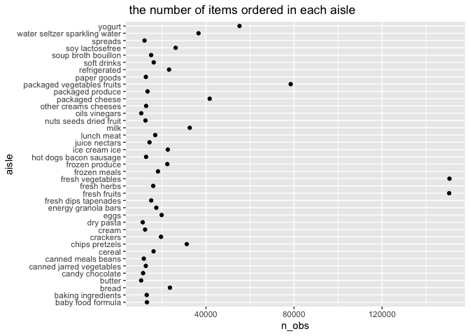

p8105\_HW3\_sl5010
================
Fiona Li
10/16/2021

## Problem 1

``` r
library(dplyr)
```

    ## 
    ## Attaching package: 'dplyr'

    ## The following objects are masked from 'package:stats':
    ## 
    ##     filter, lag

    ## The following objects are masked from 'package:base':
    ## 
    ##     intersect, setdiff, setequal, union

``` r
library(tidyverse)
```

    ## ── Attaching packages ─────────────────────────────────────── tidyverse 1.3.1 ──

    ## ✓ ggplot2 3.3.5     ✓ purrr   0.3.4
    ## ✓ tibble  3.1.4     ✓ stringr 1.4.0
    ## ✓ tidyr   1.1.3     ✓ forcats 0.5.1
    ## ✓ readr   2.0.1

    ## ── Conflicts ────────────────────────────────────────── tidyverse_conflicts() ──
    ## x dplyr::filter() masks stats::filter()
    ## x dplyr::lag()    masks stats::lag()

``` r
library(p8105.datasets)
data("instacart")
skimr::skim(instacart)
```

|                                                  |           |
|:-------------------------------------------------|:----------|
| Name                                             | instacart |
| Number of rows                                   | 1384617   |
| Number of columns                                | 15        |
| \_\_\_\_\_\_\_\_\_\_\_\_\_\_\_\_\_\_\_\_\_\_\_   |           |
| Column type frequency:                           |           |
| character                                        | 4         |
| numeric                                          | 11        |
| \_\_\_\_\_\_\_\_\_\_\_\_\_\_\_\_\_\_\_\_\_\_\_\_ |           |
| Group variables                                  | None      |

Data summary

**Variable type: character**

| skim\_variable | n\_missing | complete\_rate | min | max | empty | n\_unique | whitespace |
|:---------------|-----------:|---------------:|----:|----:|------:|----------:|-----------:|
| eval\_set      |          0 |              1 |   5 |   5 |     0 |         1 |          0 |
| product\_name  |          0 |              1 |   3 | 159 |     0 |     39123 |          0 |
| aisle          |          0 |              1 |   3 |  29 |     0 |       134 |          0 |
| department     |          0 |              1 |   4 |  15 |     0 |        21 |          0 |

**Variable type: numeric**

| skim\_variable            | n\_missing | complete\_rate |       mean |        sd |  p0 |    p25 |     p50 |     p75 |    p100 | hist  |
|:--------------------------|-----------:|---------------:|-----------:|----------:|----:|-------:|--------:|--------:|--------:|:------|
| order\_id                 |          0 |              1 | 1706297.62 | 989732.65 |   1 | 843370 | 1701880 | 2568023 | 3421070 | ▇▇▇▇▇ |
| product\_id               |          0 |              1 |   25556.24 |  14121.27 |   1 |  13380 |   25298 |   37940 |   49688 | ▆▆▇▆▇ |
| add\_to\_cart\_order      |          0 |              1 |       8.76 |      7.42 |   1 |      3 |       7 |      12 |      80 | ▇▁▁▁▁ |
| reordered                 |          0 |              1 |       0.60 |      0.49 |   0 |      0 |       1 |       1 |       1 | ▆▁▁▁▇ |
| user\_id                  |          0 |              1 |  103112.78 |  59487.15 |   1 |  51732 |  102933 |  154959 |  206209 | ▇▇▇▇▇ |
| order\_number             |          0 |              1 |      17.09 |     16.61 |   4 |      6 |      11 |      21 |     100 | ▇▂▁▁▁ |
| order\_dow                |          0 |              1 |       2.70 |      2.17 |   0 |      1 |       3 |       5 |       6 | ▇▂▂▂▆ |
| order\_hour\_of\_day      |          0 |              1 |      13.58 |      4.24 |   0 |     10 |      14 |      17 |      23 | ▁▃▇▇▃ |
| days\_since\_prior\_order |          0 |              1 |      17.07 |     10.43 |   0 |      7 |      15 |      30 |      30 | ▅▅▃▂▇ |
| aisle\_id                 |          0 |              1 |      71.30 |     38.10 |   1 |     31 |      83 |     107 |     134 | ▆▃▃▇▆ |
| department\_id            |          0 |              1 |       9.84 |      6.29 |   1 |      4 |       8 |      16 |      21 | ▇▂▂▅▂ |

**size and structure of the data**: Number of rows is 1384617, Number of
columns is 15. **key variables**: aisle, product\_name, , order\_dow,
order\_hour\_of\_day.

### How many aisles are there, and which aisles are the most items ordered from?

``` r
instacart %>%
  group_by(aisle) %>%
  summarise(n_obs = n()) %>%
  mutate (ranking = min_rank(n_obs))
```

    ## # A tibble: 134 × 3
    ##    aisle                  n_obs ranking
    ##    <chr>                  <int>   <int>
    ##  1 air fresheners candles  1067      26
    ##  2 asian foods             7007      82
    ##  3 baby accessories         306       3
    ##  4 baby bath body care      328       4
    ##  5 baby food formula      13198     109
    ##  6 bakery desserts         1501      36
    ##  7 baking ingredients     13088     108
    ##  8 baking supplies decor   1094      29
    ##  9 beauty                   287       1
    ## 10 beers coolers           1839      45
    ## # … with 124 more rows

Hence, there are 134 aisles, “fresh vegetables” aisle is the most items
ordered from, which have 150609 items.

### Make a plot that shows the number of items ordered in each aisle, limiting this to aisles with more than 10000 items ordered. Arrange aisles sensibly, and organize your plot so others can read it.

``` r
instacart %>%
  group_by(aisle) %>%
  summarise(n_obs = n()) %>%
  filter(n_obs > 10000) %>%
  ggplot(aes(x = n_obs, y = aisle)) + geom_point() +
  labs(title = " the number of items ordered in each aisle")
```

<!-- -->

### Make a table showing the three most popular items in each of the aisles “baking ingredients”, “dog food care”, and “packaged vegetables fruits”. Include the number of times each item is ordered in your table.

``` r
instacart %>%
  group_by(aisle, product_name) %>%
  summarise(n_obs = n()) %>%
  filter(aisle == "baking ingredients"| aisle == "dog food care"| aisle == "packaged vegetables fruits") %>%
  top_n(1,n_obs) %>%
  pivot_wider(
    names_from = "product_name", 
    values_from = "n_obs"
  )
```

    ## `summarise()` has grouped output by 'aisle'. You can override using the `.groups` argument.

    ## # A tibble: 3 × 4
    ## # Groups:   aisle [3]
    ##   aisle                      `Light Brown Sug… `Snack Sticks C… `Organic Baby S…
    ##   <chr>                                  <int>            <int>            <int>
    ## 1 baking ingredients                       499               NA               NA
    ## 2 dog food care                             NA               30               NA
    ## 3 packaged vegetables fruits                NA               NA             9784

### Make a table showing the mean hour of the day at which Pink Lady Apples and Coffee Ice Cream are ordered on each day of the week; format this table for human readers (i.e. produce a 2 x 7 table).

``` r
instacart %>%
  group_by(product_name, order_dow) %>%
  summarise(mean_order_hour_of_day = mean(order_hour_of_day)) %>%
  filter(product_name == "Pink Lady Apples"| product_name == "Coffee Ice Cream") %>%
  pivot_wider(
    names_from = "order_dow", 
    values_from = "mean_order_hour_of_day"
  )
```

    ## `summarise()` has grouped output by 'product_name'. You can override using the `.groups` argument.

    ## # A tibble: 2 × 8
    ## # Groups:   product_name [2]
    ##   product_name       `0`   `1`   `2`   `3`   `4`   `5`   `6`
    ##   <chr>            <dbl> <dbl> <dbl> <dbl> <dbl> <dbl> <dbl>
    ## 1 Coffee Ice Cream  13.8  14.3  15.4  15.3  15.2  12.3  13.8
    ## 2 Pink Lady Apples  13.4  11.4  11.7  14.2  11.6  12.8  11.9

## Problem 2

``` r
library(p8105.datasets)
data("brfss_smart2010")
brfss_smart2010
```

    ## # A tibble: 134,203 × 23
    ##     Year Locationabbr Locationdesc  Class  Topic Question   Response Sample_Size
    ##    <int> <chr>        <chr>         <chr>  <chr> <chr>      <chr>          <int>
    ##  1  2010 AL           AL - Jeffers… Healt… Over… How is yo… Excelle…          94
    ##  2  2010 AL           AL - Jeffers… Healt… Over… How is yo… Very go…         148
    ##  3  2010 AL           AL - Jeffers… Healt… Over… How is yo… Good             208
    ##  4  2010 AL           AL - Jeffers… Healt… Over… How is yo… Fair             107
    ##  5  2010 AL           AL - Jeffers… Healt… Over… How is yo… Poor              45
    ##  6  2010 AL           AL - Jeffers… Healt… Fair… Health St… Good or…         450
    ##  7  2010 AL           AL - Jeffers… Healt… Fair… Health St… Fair or…         152
    ##  8  2010 AL           AL - Jeffers… Healt… Heal… Do you ha… Yes              524
    ##  9  2010 AL           AL - Jeffers… Healt… Heal… Do you ha… No                77
    ## 10  2010 AL           AL - Jeffers… Healt… Unde… Adults ag… Yes              316
    ## # … with 134,193 more rows, and 15 more variables: Data_value <dbl>,
    ## #   Confidence_limit_Low <dbl>, Confidence_limit_High <dbl>,
    ## #   Display_order <int>, Data_value_unit <chr>, Data_value_type <chr>,
    ## #   Data_Value_Footnote_Symbol <chr>, Data_Value_Footnote <chr>,
    ## #   DataSource <chr>, ClassId <chr>, TopicId <chr>, LocationID <chr>,
    ## #   QuestionID <chr>, RESPID <chr>, GeoLocation <chr>

## R Markdown

This is an R Markdown document. Markdown is a simple formatting syntax
for authoring HTML, PDF, and MS Word documents. For more details on
using R Markdown see <http://rmarkdown.rstudio.com>.

When you click the **Knit** button a document will be generated that
includes both content as well as the output of any embedded R code
chunks within the document. You can embed an R code chunk like this:

``` r
summary(cars)
```

    ##      speed           dist       
    ##  Min.   : 4.0   Min.   :  2.00  
    ##  1st Qu.:12.0   1st Qu.: 26.00  
    ##  Median :15.0   Median : 36.00  
    ##  Mean   :15.4   Mean   : 42.98  
    ##  3rd Qu.:19.0   3rd Qu.: 56.00  
    ##  Max.   :25.0   Max.   :120.00

## Including Plots

You can also embed plots, for example:

<!-- -->

Note that the `echo = FALSE` parameter was added to the code chunk to
prevent printing of the R code that generated the plot.
