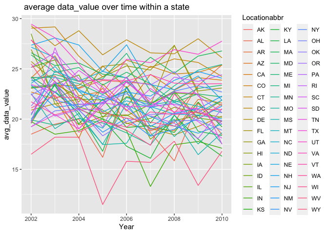
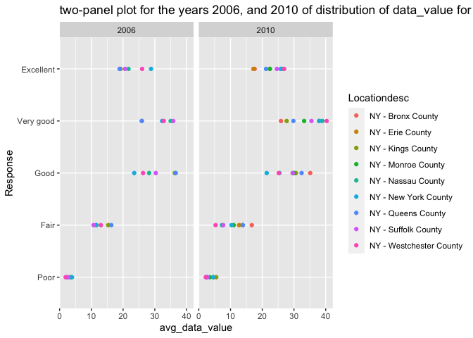
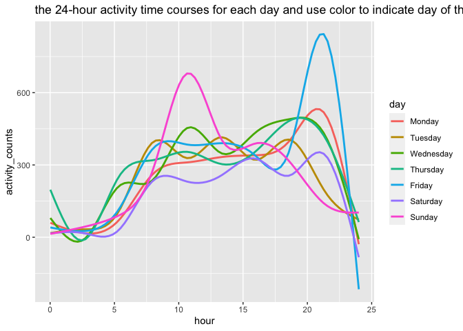

p8105\_HW3\_sl5010
================
Fiona Li
10/16/2021

## Problem 1

``` r
library(dplyr)
```

    ## 
    ## Attaching package: 'dplyr'

    ## The following objects are masked from 'package:stats':
    ## 
    ##     filter, lag

    ## The following objects are masked from 'package:base':
    ## 
    ##     intersect, setdiff, setequal, union

``` r
library(tidyverse)
```

    ## ── Attaching packages ─────────────────────────────────────── tidyverse 1.3.1 ──

    ## ✓ ggplot2 3.3.5     ✓ purrr   0.3.4
    ## ✓ tibble  3.1.4     ✓ stringr 1.4.0
    ## ✓ tidyr   1.1.3     ✓ forcats 0.5.1
    ## ✓ readr   2.0.1

    ## ── Conflicts ────────────────────────────────────────── tidyverse_conflicts() ──
    ## x dplyr::filter() masks stats::filter()
    ## x dplyr::lag()    masks stats::lag()

``` r
library(p8105.datasets)
data("instacart")
skimr::skim(instacart)
```

|                                                  |           |
|:-------------------------------------------------|:----------|
| Name                                             | instacart |
| Number of rows                                   | 1384617   |
| Number of columns                                | 15        |
| \_\_\_\_\_\_\_\_\_\_\_\_\_\_\_\_\_\_\_\_\_\_\_   |           |
| Column type frequency:                           |           |
| character                                        | 4         |
| numeric                                          | 11        |
| \_\_\_\_\_\_\_\_\_\_\_\_\_\_\_\_\_\_\_\_\_\_\_\_ |           |
| Group variables                                  | None      |

Data summary

**Variable type: character**

| skim\_variable | n\_missing | complete\_rate | min | max | empty | n\_unique | whitespace |
|:---------------|-----------:|---------------:|----:|----:|------:|----------:|-----------:|
| eval\_set      |          0 |              1 |   5 |   5 |     0 |         1 |          0 |
| product\_name  |          0 |              1 |   3 | 159 |     0 |     39123 |          0 |
| aisle          |          0 |              1 |   3 |  29 |     0 |       134 |          0 |
| department     |          0 |              1 |   4 |  15 |     0 |        21 |          0 |

**Variable type: numeric**

| skim\_variable            | n\_missing | complete\_rate |       mean |        sd |  p0 |    p25 |     p50 |     p75 |    p100 | hist  |
|:--------------------------|-----------:|---------------:|-----------:|----------:|----:|-------:|--------:|--------:|--------:|:------|
| order\_id                 |          0 |              1 | 1706297.62 | 989732.65 |   1 | 843370 | 1701880 | 2568023 | 3421070 | ▇▇▇▇▇ |
| product\_id               |          0 |              1 |   25556.24 |  14121.27 |   1 |  13380 |   25298 |   37940 |   49688 | ▆▆▇▆▇ |
| add\_to\_cart\_order      |          0 |              1 |       8.76 |      7.42 |   1 |      3 |       7 |      12 |      80 | ▇▁▁▁▁ |
| reordered                 |          0 |              1 |       0.60 |      0.49 |   0 |      0 |       1 |       1 |       1 | ▆▁▁▁▇ |
| user\_id                  |          0 |              1 |  103112.78 |  59487.15 |   1 |  51732 |  102933 |  154959 |  206209 | ▇▇▇▇▇ |
| order\_number             |          0 |              1 |      17.09 |     16.61 |   4 |      6 |      11 |      21 |     100 | ▇▂▁▁▁ |
| order\_dow                |          0 |              1 |       2.70 |      2.17 |   0 |      1 |       3 |       5 |       6 | ▇▂▂▂▆ |
| order\_hour\_of\_day      |          0 |              1 |      13.58 |      4.24 |   0 |     10 |      14 |      17 |      23 | ▁▃▇▇▃ |
| days\_since\_prior\_order |          0 |              1 |      17.07 |     10.43 |   0 |      7 |      15 |      30 |      30 | ▅▅▃▂▇ |
| aisle\_id                 |          0 |              1 |      71.30 |     38.10 |   1 |     31 |      83 |     107 |     134 | ▆▃▃▇▆ |
| department\_id            |          0 |              1 |       9.84 |      6.29 |   1 |      4 |       8 |      16 |      21 | ▇▂▂▅▂ |

**size and structure of the data**: Number of rows is 1384617, Number of
columns is 15. **key variables**: aisle, product\_name, , order\_dow,
order\_hour\_of\_day.

### How many aisles are there, and which aisles are the most items ordered from?

``` r
instacart %>%
  group_by(aisle) %>%
  summarise(n_obs = n()) %>%
  mutate (ranking = min_rank(n_obs))
```

    ## # A tibble: 134 × 3
    ##    aisle                  n_obs ranking
    ##    <chr>                  <int>   <int>
    ##  1 air fresheners candles  1067      26
    ##  2 asian foods             7007      82
    ##  3 baby accessories         306       3
    ##  4 baby bath body care      328       4
    ##  5 baby food formula      13198     109
    ##  6 bakery desserts         1501      36
    ##  7 baking ingredients     13088     108
    ##  8 baking supplies decor   1094      29
    ##  9 beauty                   287       1
    ## 10 beers coolers           1839      45
    ## # … with 124 more rows

Hence, there are 134 aisles, “fresh vegetables” aisle is the most items
ordered from, which have 150609 items.

### Make a plot that shows the number of items ordered in each aisle, limiting this to aisles with more than 10000 items ordered. Arrange aisles sensibly, and organize your plot so others can read it.

``` r
instacart %>%
  group_by(aisle) %>%
  summarise(n_obs = n()) %>%
  filter(n_obs > 10000) %>%
  ggplot(aes(x = n_obs, y = aisle)) + geom_point() +
  labs(title = " the number of items ordered in each aisle")
```

<!-- -->

### Make a table showing the three most popular items in each of the aisles “baking ingredients”, “dog food care”, and “packaged vegetables fruits”. Include the number of times each item is ordered in your table.

``` r
instacart %>%
  group_by(aisle, product_name) %>%
  summarise(n_obs = n()) %>%
## choosing aisles “baking ingredients”, “dog food care”, and “packaged vegetables fruits”.
  filter(aisle == "baking ingredients"| aisle == "dog food care"| aisle == "packaged vegetables fruits") %>%
  top_n(1,n_obs) %>%
  pivot_wider(
    names_from = "product_name", 
    values_from = "n_obs"
  )
```

    ## `summarise()` has grouped output by 'aisle'. You can override using the `.groups` argument.

    ## # A tibble: 3 × 4
    ## # Groups:   aisle [3]
    ##   aisle                      `Light Brown Sug… `Snack Sticks C… `Organic Baby S…
    ##   <chr>                                  <int>            <int>            <int>
    ## 1 baking ingredients                       499               NA               NA
    ## 2 dog food care                             NA               30               NA
    ## 3 packaged vegetables fruits                NA               NA             9784

### Make a table showing the mean hour of the day at which Pink Lady Apples and Coffee Ice Cream are ordered on each day of the week; format this table for human readers (i.e. produce a 2 x 7 table).

``` r
instacart %>%
  group_by(product_name, order_dow) %>%
  summarise(mean_order_hour_of_day = mean(order_hour_of_day)) %>%
  filter(product_name == "Pink Lady Apples"| product_name == "Coffee Ice Cream") %>%
  pivot_wider(
    names_from = "order_dow", 
    values_from = "mean_order_hour_of_day"
  )
```

    ## `summarise()` has grouped output by 'product_name'. You can override using the `.groups` argument.

    ## # A tibble: 2 × 8
    ## # Groups:   product_name [2]
    ##   product_name       `0`   `1`   `2`   `3`   `4`   `5`   `6`
    ##   <chr>            <dbl> <dbl> <dbl> <dbl> <dbl> <dbl> <dbl>
    ## 1 Coffee Ice Cream  13.8  14.3  15.4  15.3  15.2  12.3  13.8
    ## 2 Pink Lady Apples  13.4  11.4  11.7  14.2  11.6  12.8  11.9

## Problem 2

``` r
library(p8105.datasets)
  data("brfss_smart2010")
```

### do some data cleaning:

``` r
## format the data to use appropriate variable names
janitor::clean_names(brfss_smart2010)
```

    ## # A tibble: 134,203 × 23
    ##     year locationabbr locationdesc  class  topic question   response sample_size
    ##    <int> <chr>        <chr>         <chr>  <chr> <chr>      <chr>          <int>
    ##  1  2010 AL           AL - Jeffers… Healt… Over… How is yo… Excelle…          94
    ##  2  2010 AL           AL - Jeffers… Healt… Over… How is yo… Very go…         148
    ##  3  2010 AL           AL - Jeffers… Healt… Over… How is yo… Good             208
    ##  4  2010 AL           AL - Jeffers… Healt… Over… How is yo… Fair             107
    ##  5  2010 AL           AL - Jeffers… Healt… Over… How is yo… Poor              45
    ##  6  2010 AL           AL - Jeffers… Healt… Fair… Health St… Good or…         450
    ##  7  2010 AL           AL - Jeffers… Healt… Fair… Health St… Fair or…         152
    ##  8  2010 AL           AL - Jeffers… Healt… Heal… Do you ha… Yes              524
    ##  9  2010 AL           AL - Jeffers… Healt… Heal… Do you ha… No                77
    ## 10  2010 AL           AL - Jeffers… Healt… Unde… Adults ag… Yes              316
    ## # … with 134,193 more rows, and 15 more variables: data_value <dbl>,
    ## #   confidence_limit_low <dbl>, confidence_limit_high <dbl>,
    ## #   display_order <int>, data_value_unit <chr>, data_value_type <chr>,
    ## #   data_value_footnote_symbol <chr>, data_value_footnote <chr>,
    ## #   data_source <chr>, class_id <chr>, topic_id <chr>, location_id <chr>,
    ## #   question_id <chr>, respid <chr>, geo_location <chr>

``` r
## focus on the “Overall Health” topic
brfss_smart2010 = 
brfss_smart2010 %>%
## include only responses from “Excellent” to “Poor”
  filter(Topic == "Overall Health", Response == "Excellent"|Response =="Poor" |Response == "Fair"|Response == "Very good"|Response =="Good") %>%
  mutate(Response = factor(Response, levels = c("Poor","Fair","Good","Very good","Excellent")))
## organize responses as a factor taking levels ordered from “Poor” to “Excellent”
brfss_smart2010$Response = as.factor(brfss_smart2010$Response)
```

### In 2002, which states were observed at 7 or more locations? What about in 2010?

``` r
brfss_smart2010 %>%
  filter(Year == 2002) %>%
  select(Locationabbr, Locationdesc) %>%
  group_by(Locationabbr) %>%
  summarise(num_location = length(unique(Locationdesc))) %>%
  filter(num_location >= 7)
```

    ## # A tibble: 6 × 2
    ##   Locationabbr num_location
    ##   <chr>               <int>
    ## 1 CT                      7
    ## 2 FL                      7
    ## 3 MA                      8
    ## 4 NC                      7
    ## 5 NJ                      8
    ## 6 PA                     10

Hence, states were observed at 7 or more locations are : CT, FL, MA, NC,
NJ, PA in 2002.

``` r
brfss_smart2010 %>%
  filter(Year == 2010) %>%
  select(Locationabbr, Locationdesc) %>%
  group_by(Locationabbr) %>%
  summarise(num_location = length(unique(Locationdesc))) %>%
  filter(num_location >= 7)
```

    ## # A tibble: 14 × 2
    ##    Locationabbr num_location
    ##    <chr>               <int>
    ##  1 CA                     12
    ##  2 CO                      7
    ##  3 FL                     41
    ##  4 MA                      9
    ##  5 MD                     12
    ##  6 NC                     12
    ##  7 NE                     10
    ##  8 NJ                     19
    ##  9 NY                      9
    ## 10 OH                      8
    ## 11 PA                      7
    ## 12 SC                      7
    ## 13 TX                     16
    ## 14 WA                     10

Hence, states were observed at 7 or more locations are : CA, Co, FL, MA,
MD, NC, NE, NJ, NY, OH, PA, SC, TX, WA in 2010.

### Construct a dataset that is limited to Excellent responses, and contains, year, state, and a variable that averages the data\_value across locations within a state. Make a “spaghetti” plot of this average value over time within a state

``` r
brfss_smart2010 %>%
  ## limited to Excellent responses
  filter(Response == "Excellent") %>%
  select(Year, Locationabbr, Data_value) %>%
  group_by(Year, Locationabbr) %>%
  summarise(avg_data_value = mean(Data_value)) %>%
  ## Make a “spaghetti” plot
  ggplot( aes(x = Year, y = avg_data_value, color = Locationabbr)) + 
  geom_line() +
  labs(title = " average data_value over time within a state")
```

    ## `summarise()` has grouped output by 'Year'. You can override using the `.groups` argument.

    ## Warning: Removed 3 row(s) containing missing values (geom_path).

<!-- -->

### Make a two-panel plot showing, for the years 2006, and 2010, distribution of data\_value for responses (“Poor” to “Excellent”) among locations in NY State.

``` r
brfss_smart2010 %>%
  filter(Year == 2006 | Year == 2010, Locationabbr == "NY") %>%
  select(Year,Response, Data_value,Locationdesc) %>%
  group_by(Response, Year,Locationdesc) %>%
  summarise(avg_data_value = mean(Data_value)) %>%
  ggplot( aes(x = avg_data_value, y = Response, color = Locationdesc)) + geom_point() + facet_grid(. ~ Year) + labs(title = "two-panel plot for the years 2006, and 2010 of distribution of data_value for responses among locations in NY State")
```

    ## `summarise()` has grouped output by 'Response', 'Year'. You can override using the `.groups` argument.

<!-- -->
\#\# Problem 3

### Load, tidy, and otherwise wrangle the data. Your final dataset should include all originally observed variables and values; have useful variable names; include a weekday vs weekend variable; and encode data with reasonable variable classes. Describe the resulting dataset

``` r
accel_df = read_csv("Data/accel_data.csv") %>%
mutate(weekdayVSweekend = case_when(
      day ==  "Friday" ~ "weekday",
      day ==  "Monday" ~ "weekday",
      day ==  "Tuesday" ~ "weekday",
      day ==  "Wednesday" ~ "weekday",
      day ==  "Thursday" ~ "weekday",
      day == "Sunday" ~ "weekend",
      day == "Saturday" ~ "weekend",
  ))
```

    ## Rows: 35 Columns: 1443

    ## ── Column specification ────────────────────────────────────────────────────────
    ## Delimiter: ","
    ## chr    (1): day
    ## dbl (1442): week, day_id, activity.1, activity.2, activity.3, activity.4, ac...

    ## 
    ## ℹ Use `spec()` to retrieve the full column specification for this data.
    ## ℹ Specify the column types or set `show_col_types = FALSE` to quiet this message.

``` r
accel_df =
accel_df %>%
pivot_longer(
    activity.1:activity.1440,
    names_to = "min", 
    values_to = "activity_counts") %>%
separate(min, into = c("activity", "min"), sep = 9) %>%
select(-activity, -day_id) %>%
mutate(min = as.numeric(min))
skimr::skim(accel_df)
```

|                                                  |           |
|:-------------------------------------------------|:----------|
| Name                                             | accel\_df |
| Number of rows                                   | 50400     |
| Number of columns                                | 5         |
| \_\_\_\_\_\_\_\_\_\_\_\_\_\_\_\_\_\_\_\_\_\_\_   |           |
| Column type frequency:                           |           |
| character                                        | 2         |
| numeric                                          | 3         |
| \_\_\_\_\_\_\_\_\_\_\_\_\_\_\_\_\_\_\_\_\_\_\_\_ |           |
| Group variables                                  | None      |

Data summary

**Variable type: character**

| skim\_variable   | n\_missing | complete\_rate | min | max | empty | n\_unique | whitespace |
|:-----------------|-----------:|---------------:|----:|----:|------:|----------:|-----------:|
| day              |          0 |              1 |   6 |   9 |     0 |         7 |          0 |
| weekdayVSweekend |          0 |              1 |   7 |   7 |     0 |         2 |          0 |

**Variable type: numeric**

| skim\_variable   | n\_missing | complete\_rate |   mean |     sd |  p0 |    p25 |   p50 |     p75 | p100 | hist  |
|:-----------------|-----------:|---------------:|-------:|-------:|----:|-------:|------:|--------:|-----:|:------|
| week             |          0 |              1 |   3.00 |   1.41 |   1 |   2.00 |   3.0 |    4.00 |    5 | ▇▇▇▇▇ |
| min              |          0 |              1 | 720.50 | 415.70 |   1 | 360.75 | 720.5 | 1080.25 | 1440 | ▇▇▇▇▇ |
| activity\_counts |          0 |              1 | 267.04 | 443.16 |   1 |   1.00 |  74.0 |  364.00 | 8982 | ▇▁▁▁▁ |

**Describe the resulting dataset**: the existing variables are: day,
weekdayVSweekend, week, min, activity\_counts. The number of
observations are 50400

### Traditional analyses of accelerometer data focus on the total activity over the day. Using your tidied dataset, aggregate accross minutes to create a total activity variable for each day, and create a table showing these totals. Are any trends apparent?

``` r
total_activity_df =
accel_df %>%
  group_by(week,day) %>%
  summarise(total_activity = sum(activity_counts))
```

    ## `summarise()` has grouped output by 'week'. You can override using the `.groups` argument.

``` r
  pivot_wider(
  total_activity_df,
  names_from = "day", 
  values_from = "total_activity")
```

    ## # A tibble: 5 × 8
    ## # Groups:   week [5]
    ##    week  Friday  Monday Saturday Sunday Thursday Tuesday Wednesday
    ##   <dbl>   <dbl>   <dbl>    <dbl>  <dbl>    <dbl>   <dbl>     <dbl>
    ## 1     1 480543.  78828.   376254 631105  355924. 307094.   340115.
    ## 2     2 568839  295431    607175 422018  474048  423245    440962 
    ## 3     3 467420  685910    382928 467052  371230  381507    468869 
    ## 4     4 154049  409450      1440 260617  340291  319568    434460 
    ## 5     5 620860  389080      1440 138421  549658  367824    445366

### Accelerometer data allows the inspection activity over the course of the day. Make a single-panel plot that shows the 24-hour activity time courses for each day and use color to indicate day of the week. Describe in words any patterns or conclusions you can make based on this graph.

``` r
accel_df %>%
  ggplot(aes(x = min, y = activity_counts, color = day)) + 
  geom_smooth(se = FALSE) 
```

    ## `geom_smooth()` using method = 'gam' and formula 'y ~ s(x, bs = "cs")'

<!-- -->
